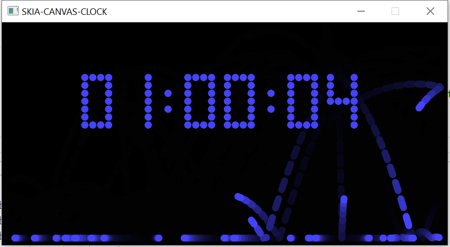

#  skia-canvas clock

    
This simple canvas animation was ported from HTML-canvas to this DWM SkiaCanvas-Window.    
SEE:  Deno Window Manager:  https://github.com/deno-windowing/dwm    

This application when in html, used a `tick()` method fired by `requestAnimationFrame` for its animation. I was able to simply move the code from `tick()` to the DWM-canvasWindow.mainloop(), and with very little fuss, I had a working desktop-clock.

The team at DWM has been very helpful and very patient with this old-fart! Thanks!

 
## run with:    
deno run -A --unstable ./clock.ts